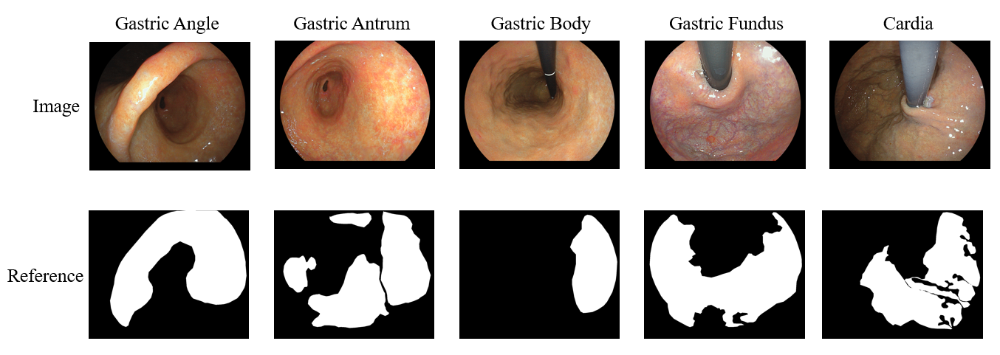
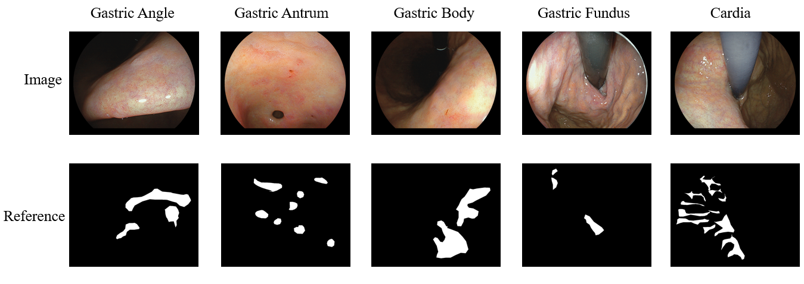

# SSDR
The official pytorch implemention of the paper ”SSDR: Semi-Supervised Dual Regularization for Endoscopic Image Analysis With Noisy Labels”
# Introduction
We propose a novel semi-supervised dual-regularization method that leverages noisy samples to enhance model robustness and thereby improve the performance of endoscopic image analysis under noisy-label scenarios.
# Dependencies
• python 3.6.13
• numpy 1.19.5
• pytorch 1.7.1
• torchvision 0.8.2
# Training
1. Download CIFAR-10 or KVASIR datasets into ./data/.
2. python main.py  --dataset cifar10 --seed 101 --batch-size=128 --arch resnet32 --method ours
# Dataset
Our endoscopic lesion segmentation dataset WCH consisting of 6,420 images of atrophic gastritis and 3,728 images of intestinal metaplasia. The complete dataset can be obtained from the corresponding author upon reasonable request (email: c.luo@uestc.edu.cn).
The following presents a subset of the data from WCH:
GA

IM

